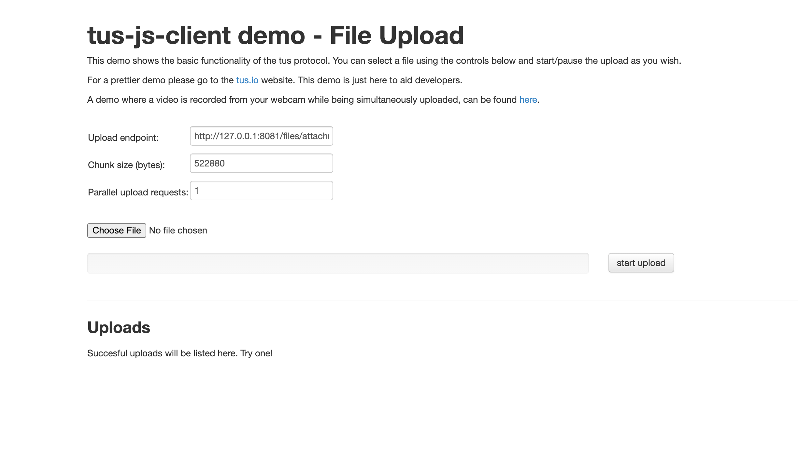

# Overview

tus-server provides an implementation of the [TUS protocol](https://tus.io) for resumable uploads built on [cloudflare workers](https://www.cloudflare.com/products/workers/) and [R2](https://www.cloudflare.com/products/r2/). 



# Building
You'll need [Node.js](https://nodejs.org/).

To install dependencies,
```
bun install
```

In order to deploy to cloudflare or use non-local dev mode, use the [`wrangler`](https://developers.cloudflare.com/workers/wrangler/install-and-update/) utility. Follow those instructions to authenticate with your cloudflare account.

# Testing

The server work without authentification, but a empty middleware is provided to help you set it up.


To run a dev server you can interact with over localhost with local wrangler
```
bun run start:server
```

Open another shell and run: 
```
bun run start:demo
```

# Deploying

## Notes

Change the auth system, to implement your own current one works with a shared secret, that is used in tus-server and tus-resumable-upload-js


## One time setup
1. Create an R2 bucket and update the binding in `wrangler.toml`
2. Change the auth system to your needs
3. Deploy with wrangler

```
wrangler deploy -e <staging|production>
```

# License

Copyright 2024 Capgo, Digital shift OU

Licensed under the [AGPLv3](LICENSE)

# Credit

This is a hard fork of https://github.com/signalapp/tus-server/blob/main/README.md

Rewrited to work in the [Capgo (live update for CapacitorJS apps)](https://capgo.app) tech stack, and in frontend

